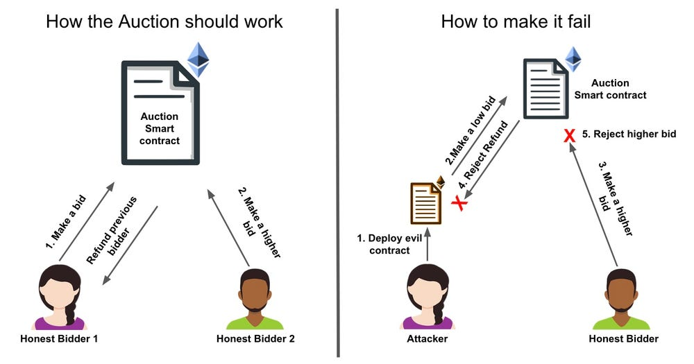

* The **Auction.sol** contract allows users to bid for ERC721 NFT tokens for a duration of 7 days, after which the highest bidder may collect the NFT from the contract.

* The bidding design of the function **bid()** checks if the new bid amount is higher than the existing bidding amount, if the new bid amount is higher than it transfers the previous bid amount to previous bidder using the **transfer** call.

```solidity
            if (bidInfo[_id].bid < msg.value) {
                payable(bidInfo[_id].bidder).transfer(bidInfo[_id].bid);
                bidInfo[_id] = Bid({bidder: msg.sender, bid: msg.value, status: true});
```

* However it contains a design flaw that, when exploited, gives a malicious bidder the opportunity to walk away with the NFT for the lowest price. Using the desing flaw a malicious bidder can block all other bids to the NFT auction.



The malicious contract for the proof of concept can be found under : `contracts/attack/AuctionAttack.sol`

This is a typical result of the POC execution:

```
npx hardhat run pocs/4.js 

 CHALLENGE - 4


 EXPLOIT : 

Mint a new NFT
The initial owner of NFT # 1 is 0x5FbDB2315678afecb367f032d93F642f64180aa3
The attacker's initial balance is:  10000.0 ETH
Attacker address: 0x15d34AAf54267DB7D7c367839AAf71A00a2C6A65 deploys a corrupt contract with enough ETH to make a bid.
The attacker's contract makes the lowest bid.
bidder1's high bid is expected to fail.
bidder2's higher bid also fails.
Fast forward 7 days, it is NFT collection time!
Now the NFT owner is  0x15d34AAf54267DB7D7c367839AAf71A00a2C6A65
The attacker's final balance is:  9998.998920648138620407
```

* In order to isolate all external calls from each other and the contract logic, the Pull over Push pattern shifts the risk associated with the ether transfer to the user, by letting him withdraw (pull) a certain amount, which would otherwise have to be sent to him (push).

For further reading about this type of vulnerability:
- https://swcregistry.io/docs/SWC-113
- https://consensys.github.io/smart-contract-best-practices/attacks/denial-of-service/#dos-with-unexpected-revert

Image attribution: using avatars from https://pixabay.com/users/coffeebeanworks-558718/. Pixabay License: Free for commercial use, No attribution required
